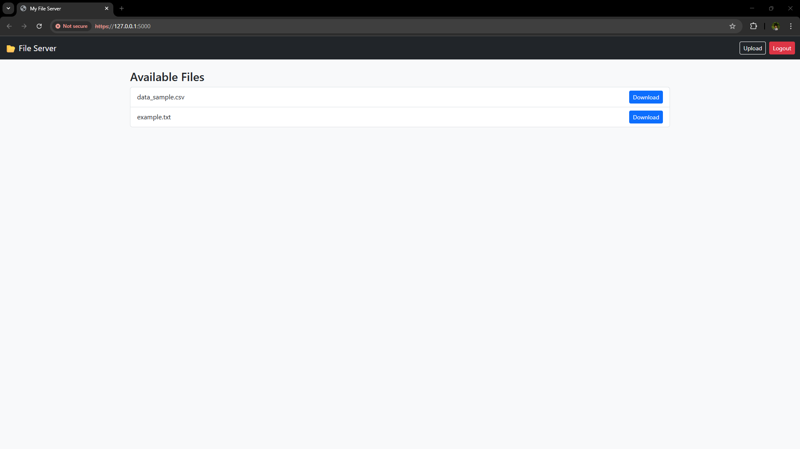
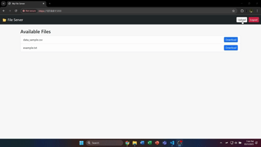

# 📂 Python Download/Upload Server

A **Flask-based local server** for downloading and uploading files between your laptop and mobile devices on the same WiFi network.  
Includes **authentication**, **modern UI**, and **HTTPS** (self-signed) support.

---

## 🔹 Features

- ✅ Download files hosted on your laptop.
- ✅ Upload files from your phone or other devices.
- ✅ Login-protected access with username/password.
- ✅ Modern **Bootstrap 5** responsive UI.
- ✅ HTTPS encrypted connection (self-signed certificate).
- ✅ Works across devices on the same local network.

---

## 🖼 Demo

**Laptop UI:**  


**Mobile UI:**  


**Upload/Download Demo GIF:**  


> _Replace the screenshots/GIF with your own captures._

---

## 🛠 Setup Instructions

1. **Clone the repository:**
```bash
git clone https://github.com/Sajeed7804/python-download-server.git
cd python-download-server
